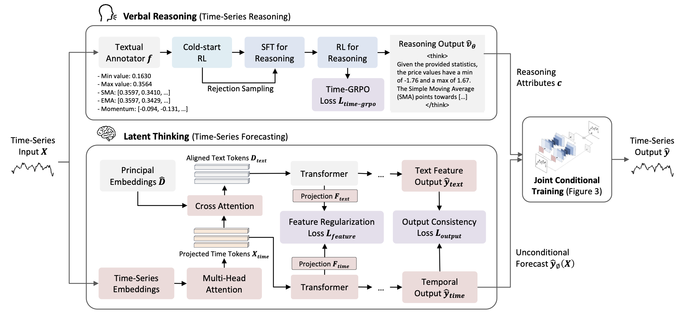
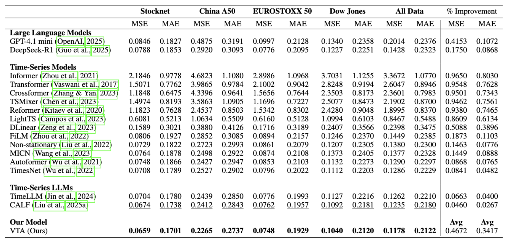
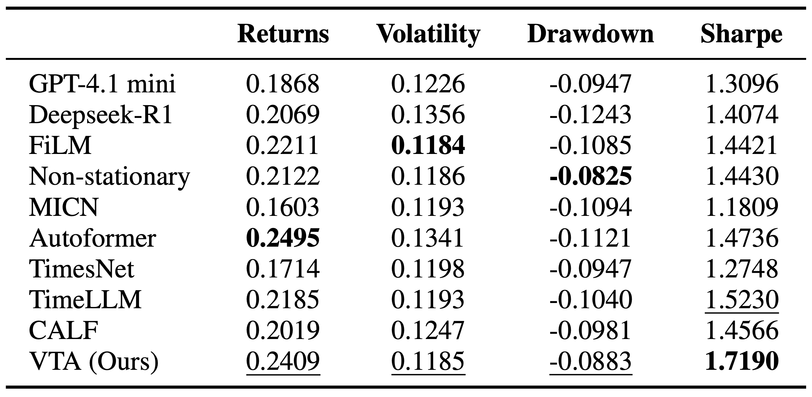

# VTA: Reasoning on Time-Series for Financial Technical Analysis

[](https://opensource.org/licenses/MIT)


## 🔍 Overview

Stock time-series forecasting models are often black-boxes, limiting their adoption in real-world investing.  
We introduce **Verbal Technical Analysis (VTA)**, the first framework for **explainable stock time-series forecasting**.  
VTA fine-tunes Large Language Models (LLMs) to **verbally reason about predictive patterns** in time-series via **Time-Series Group Relative Policy Optimization (Time-GRPO)**, and conditions forecasts on these reasoning traces with a backbone forecasting model.  

Our approach:
- Produces **high-quality reasoning traces** that explain forecasts.  
- Achieves **state-of-the-art prediction accuracy** across U.S., Chinese, and European markets.  
- Utilizes **Time-GRPO** to fine-tune an LLM for reasoning, and conditions a powerful forecasting backbone on its output to ensure both accuracy and interpretability
<p align="center">
  
</p>

---

## 🚀 Getting Started


### Environment
```bash
conda create -y -n vta python=3.11
conda activate vta
conda install -y -c pytorch -c nvidia pytorch torchvision torchaudio pytorch-cuda=12.1
conda install -y -c conda-forge libta-lib
pip install -r requirements.txt
```

## 📊 Quick demos
Run the backbone demos first (uses included example GRPO outputs) — good for sanity checks.
```bash
cd backbone
# prepare embeddings once
python pca.py

# single stock (~3–5 min)
./scripts/vta_demo_single.sh

# multi stock (~3–4 hours)
./scripts/vta_demo_multi.sh
```
Where to edit inside the scripts:
- `vta_demo_single.sh`: set `ROOT_PATH`, `DATA_PATH`, `REF_CSV_DIR`.
- `vta_demo_multi.sh`: set `ROOT_PATH`, `REF_CSV_DIR`.

## 📂 Adding Your Own Data
- Place your CSVs in `backbone/data/stocknet/` (e.g., `AAPL.csv`, `MSFT.csv`, ...).
- Format (Yahoo Finance style):
```text
Date,Open,High,Low,Close,Adj Close,Volume
```
- One CSV per stock/ticker. Example files are already included under `backbone/data/stocknet/`.


## 🧩 Full Pipeline

### Step 1) Preprocess to GRPO format (from repo root)
```bash
python combined_preprocessor.py \
  --root_path backbone/data/stocknet \
  --output_dir grpo/data/stocknet
```
Notes:
- Change `--root_path` to your raw CSV folder (e.g., `backbone/data/stocknet`).
- Change `--output_dir` to where preprocessed splits should be written (default `grpo/data/<DATASET_NAME>`).

### Step 2) Train GRPO
```bash
cd grpo
./run_pipeline.sh
```
What it writes:
- Trained adapters under `grpo/models/<MODEL>/<STOCK>/`
- Per-stage results under `grpo/results/<STOCK>_<MODEL>_.../`
- Per-stock GRPO reference CSVs for the backbone under `backbone/data/grpo_input/<DATASET_LABEL>/<MODEL_NAME>/` (controlled by `--dataset-label` in `split_grpo_outputs.py`).

### Results and outputs
- GRPO:
  - Logs/results: `grpo/results/<STOCK>_<MODEL>_.../`
  - Adapters: `grpo/models/<MODEL>/<STOCK>/`
  - Reference CSVs for backbone: `backbone/data/grpo_input/<DATASET_LABEL>/<MODEL_NAME>/`
- Backbone:
  - Checkpoints: `backbone/checkpoints/<MODEL_ID>_*`
  - Metrics/arrays: `backbone/results/<MODEL_ID>_<TIMESTAMP>/`

### Step 3) Run backbone forecasting with conditional reasoning guidance 
```bash
cd ../backbone
# Prepare word token embeddings once
python pca.py
# Quick single-stock demo
./scripts/vta_demo_single.sh

# Multi-stock demo
./scripts/vta_demo_multi.sh
```

## 📈 Results
<p align="center">
  
</p>

- VTA outperforms all baselines across StockNet, Dow Jones, EURO STOXX 50, and China A50.
- Produces reasoning traces judged higher in clarity, depth, and coherence compared to GPT-4.1 mini and DeepSeek-R1.
- In portfolio construction, VTA achieves the highest Sharpe ratio.

<p align="center">
  
</p>


## 📁 Repository Layout

<pre>
.
├── combined_preprocessor.py    # Converts raw stock CSVs → GRPO-ready
├── grpo/                      # Multi-stage training pipeline
│   ├── run_pipeline.sh
│   └── models/   results/
├── backbone/                  # Cross-modal forecaster
│   ├── pca.py
│   ├── scripts/vta_demo_*.sh
│   └── checkpoints/   results/
└── assets/                    # Figures and diagrams
</pre>


## License & Acknowledgements
This project is licensed under the MIT License. See `LICENSE` for details.

We gratefully acknowledge the authors of CALF (cross-modal fine-tuning) for their foundational model implementations and inspiration. Please refer to their repository for citation details.

Note on runtimes:
- Full end-to-end pipeline (including GRPO stages) can take ~80–120 hours on a single RTX A5000.
- Quick demos (backbone only):
  - `backbone/scripts/vta_demo_single.sh` runs a single-stock demo in ~3–5 minutes on one GPU.
  - `backbone/scripts/vta_demo_multi.sh` runs a multi-stock demo in ~3–4 hours on one GPU.


